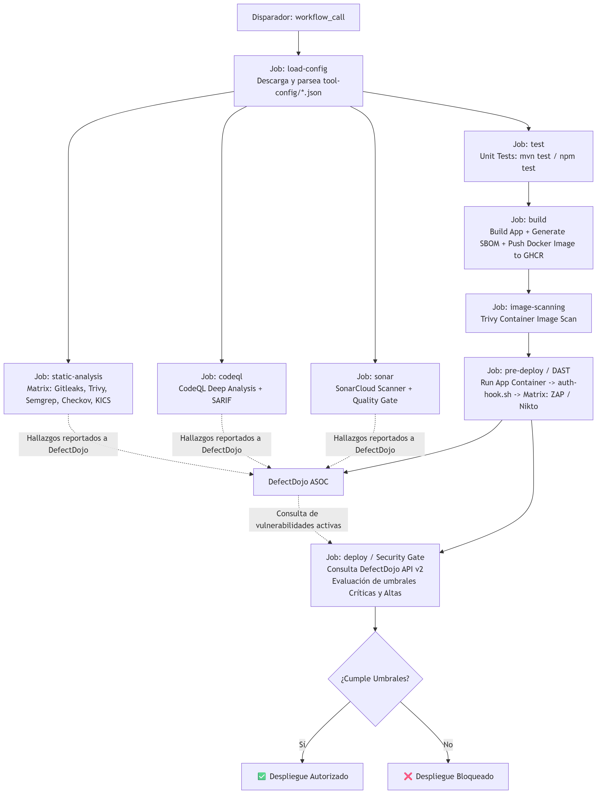

# Security Scans Orchestrator

[](https://github.com/features/actions)
[](#)
[](https://www.defectdojo.org/)
[](#)
[](#)

Sistema centralizado y reutilizable de **orquestación de seguridad (*Shared Library*)** para pipelines de CI/CD sobre **GitHub Actions**. Permite integrar controles de seguridad multicapa (*Shift-Left*) en cualquier repositorio de aplicaciones web con una configuración mínima, gestionando de forma unificada la ingesta, deduplicación y triaje de vulnerabilidades en **OWASP DefectDojo**.

---

## Tabla de contenidos

- [Características principales](#características-principales)
- [Arquitectura del sistema](#arquitectura-del-sistema)
  - [Flujo de ejecución del pipeline](#flujo-de-ejecución-del-pipeline)
  - [Estructura del repositorio](#estructura-del-repositorio)
- [Motor de configuración dinámica](#motor-de-configuración-dinámica)
- [Batería de herramientas integradas](#batería-de-herramientas-integradas)
- [Módulos y composite actions](#módulos-y-composite-actions)
- [Cómo consumir el orquestador](#cómo-consumir-el-orquestador)
- [Cómo extender o añadir nuevas herramientas](#cómo-extender-o-añadir-nuevas-herramientas)
- [Seguridad y buenas prácticas](#seguridad-y-buenas-prácticas)

---

## Características principales

* **Patrón Shared Library:** La lógica pesada de ejecución se centraliza en este repositorio (`gha-sec-scans/orchestrator`). Los repositorios clientes solo requieren un archivo de workflow de menos de 20 líneas.
* **Soporte políglota y Fullstack:** Detección automática y preparación de entornos para **Java / Maven** (Spring Boot) y **Node.js** (Express, Fastify, TypeScript, arquitecturas monolito/fullstack con frontend SPA compilado y dependencias nativas).
* **Desacoplamiento declarativo (`tool-config/`):** La adición, versionado o parametrización de herramientas de escaneo se define en archivos JSON sin tocar el código YAML de los workflows.
* **Cobertura DevSecOps multicapa:**
  * **SAST (Static Application Security Testing):** Semgrep, CodeQL y SonarCloud.
  * **SCA (Software Composition Analysis):** Trivy FS.
  * **SBOM (Software Bill of Materials):** Generación CycloneDX (Maven / Trivy) e importación en DefectDojo.
  * **Secret Scanning:** Gitleaks con expresiones regulares y entropía de Shannon.
  * **IaC Scanning:** Checkov y KICS para Dockerfiles y manifiestos de infraestructura.
  * **Container Image Scanning:** Trivy sobre imágenes empaquetadas en GHCR.
  * **DAST (Dynamic Application Security Testing):** Despliegue efímero en contenedor y auditoría activa con OWASP ZAP y Nikto.
* **Security Quality Gate automatizado:** Acción modular que consulta la API v2 de DefectDojo antes del despliegue, evalúa umbrales de severidad activa (*Critical* y *High*) y publica una tabla resumen en el Step Summary de GitHub Actions, bloqueando el despliegue si se incumplen las políticas de seguridad.
* **Autenticación dinámica en DAST:** Soporte para inyección de credenciales de sesión en caliente mediante el hook extensible `auth-hook.sh` (cookies, Bearer tokens, headers personalizados).
* **Centralización ASOC:** Envío desatendido de reportes estructurados (JSON/SARIF/XML) a la API v2 de DefectDojo con creación automática de contextos (*Products* y *Engagements*).
* **Rendimiento optimizado:** Paralelización en matrices concurrentes (*Matrix Strategy*) y memorias intermedias de caché (`setup-java`, `setup-node`, Docker Buildx GHA cache).

---

## Arquitectura del sistema

### Flujo de ejecución del pipeline



### Estructura del repositorio

```text
orchestrator/
├── .github/
│   ├── actions/
│   │   ├── build/
│   │   │   ├── maven/action.yml          # Build Java, generación de SBOM y Docker build/push
│   │   │   └── node/action.yml           # Build Node.js, compilación TS/SPA y Docker build/push
│   │   ├── security/
│   │   │   ├── sast-template/action.yaml # Contenedor genérico para escáneres estáticos Docker
│   │   │   ├── dast-template/action.yml  # Contenedor genérico para escáneres dinámicos Docker con health probe
│   │   │   ├── codeql-analysis/action.yml# Integración CodeQL y volcado SARIF a DefectDojo
│   │   │   ├── sonar-analysis/action.yml # Integración SonarCloud y reporte a DefectDojo
│   │   │   ├── image-scanning/action.yml # Escaneo de vulnerabilidades en imagen Docker con Trivy
│   │   │   └── quality-gate/action.yml   # Quality Gate de seguridad contra la API v2 de DefectDojo
│   │   └── utils/
│   │       ├── load-config/action.yml    # Descarga y parsea JSONs en matrices de GitHub Actions
│   │       ├── setup/action.yaml         # Detección de stack tecnológico y configuración de cachés
│   │       └── defectdojo-upload/action.yml # Cliente HTTP hacia la API v2 de DefectDojo
│   ├── tool-config/
│   │   ├── sast-tools.json               # Configuración de herramientas estáticas (SAST, SCA, IaC, Secretos)
│   │   └── dast-tools.json               # Configuración de herramientas dinámicas (ZAP, Nikto)
│   └── workflows/
│       └── main.yaml                     # Reusable Workflow maestro orquestador
├── docs/
│   └── images/
│       └── workflow.png                  # Diagrama visual de ejecución del pipeline
├── CONSUMER_README.md                    # Guía para repositorios consumidores (Java, Node.js)
├── DEFECTDOJO_SETUP.md                   # Despliegue local de DefectDojo, Cloudflare Tunnel y secretos
└── README.md                             # Documentación técnica general del orquestador
```

---

## Motor de configuración dinámica

En lugar de incrustar comandos y nombres de herramientas en los ficheros YAML, el orquestador utiliza **configuraciones desacopladas en JSON**:

### `.github/tool-config/sast-tools.json`
Define las herramientas estáticas que se ejecutarán concurrentemente en la matriz del job `static-analysis`:

```json
{
  "gitleaks": {
    "image": "zricethezav/gitleaks:v8.30.1",
    "command": "gitleaks detect -v --source=. --report-format=json --report-path=gitleaks.json",
    "report_file": "gitleaks.json",
    "dojo_scan_type": "Gitleaks Scan"
  },
  "trivy": {
    "image": "aquasec/trivy:0.74.0",
    "command": "trivy fs --scanners vuln --offline-scan . --format json --output trivy.json",
    "report_file": "trivy.json",
    "dojo_scan_type": "Trivy Scan"
  },
  "semgrep": {
    "image": "semgrep/semgrep:1.175.0",
    "command": "semgrep scan --config=p/default --json --output=semgrep.json /code",
    "report_file": "semgrep.json",
    "dojo_scan_type": "Semgrep JSON Report"
  },
  "checkov": {
    "image": "bridgecrew/checkov:3.3.16",
    "command": "checkov -d /code --output json --output-file-path /code",
    "report_file": "results_json.json",
    "dojo_scan_type": "Checkov Scan"
  },
  "kics": {
    "image": "checkmarx/kics:v2.1.20",
    "command": "/app/bin/kics scan -p /code -o /code --output-name kics --report-formats json --ignore-on-exit all",
    "report_file": "kics.json",
    "dojo_scan_type": "KICS Scan"
  }
}
```

### `.github/tool-config/dast-tools.json`
Define las herramientas dinámicas que se ejecutarán contra la aplicación levantada en caliente:

```json
{
  "zap": {
    "image": "zaproxy/zap-stable:2.17.0",
    "command": "zap-baseline.py -t <TARGET_URL> -x zap-report.xml -I -z \"-config replacer.full_list(0).description=auth -config replacer.full_list(0).enabled=true -config replacer.full_list(0).matchtype=req_header -config replacer.full_list(0).matchstr=<AUTH_HEADER_NAME> -config replacer.full_list(0).replacement=<AUTH_HEADER_VALUE>\"",
    "report_file": "zap-report.xml",
    "dojo_scan_type": "ZAP Scan"
  },
  "nikto": {
    "image": "ghcr.io/sullo/nikto:2.6.1",
    "command": "-h <TARGET_URL> -Format xml -o nikto-report.xml",
    "report_file": "nikto-report.xml",
    "dojo_scan_type": "Nikto Scan"
  }
}
```

---

## Batería de herramientas integradas

| Disciplina | Motor / Herramienta | Versión Fijada | Formato de Reporte | Scan Type en DefectDojo |
| :--- | :--- | :--- | :--- | :--- |
| **Secret Scanning** | **Gitleaks** | `v8.30.1` | JSON Nativo | `Gitleaks Scan` |
| **SCA (Dependencias)** | **Trivy FS** | `0.74.0` | JSON Nativo | `Trivy Scan` |
| **SAST (Reglas)** | **Semgrep** | `1.175.0` | JSON Nativo | `Semgrep JSON Report` |
| **SAST (Deep Taint)** | **GitHub CodeQL** | `v4` Action | SARIF | `SARIF` |
| **SAST & Quality** | **SonarCloud** | Maven / Action | JSON API | `SonarQube Scan` |
| **IaC (Infraestructura)** | **Checkov** | `3.3.16` | JSON Nativo | `Checkov Scan` |
| **IaC (Misconfig)** | **KICS** | `v2.1.20` | JSON Nativo | `KICS Scan` |
| **SBOM (Inventario)** | **CycloneDX** | Plugin Maven / Trivy | JSON CycloneDX | `CycloneDX Scan` |
| **Container Scanning** | **Trivy Image** | `0.35.0` Action | JSON Nativo | `Trivy Image Scanning` |
| **DAST (Vulnerabilidades)** | **OWASP ZAP** | `2.17.0` | XML / JSON | `ZAP Scan` |
| **DAST (Configuración Web)** | **Nikto** | `2.6.1` | XML | `Nikto Scan` |

---

## Módulos y composite actions

### 1. `utils/load-config`
Descarga la carpeta `.github/tool-config/` del repositorio orquestador y utiliza `jq` para convertir los archivos JSON en matrices nativas (`outputs.sast_matrix`, `outputs.dast_matrix`) y configuraciones completas (`outputs.sast_config`, `outputs.dast_config`).

### 2. `utils/setup`
Detecta automáticamente el stack de la aplicación inspeccionando la presencia de `pom.xml` (Maven/Java) o `package.json` (Node.js). Configura el entorno y las cachés de dependencias con `actions/setup-java@v5` o `actions/setup-node@v5`.

### 3. `security/sast-template`
Acción genérica que levanta un contenedor Docker efímero con el código fuente montado en volumen (`-v ${{ github.workspace }}:/code`), ejecuta el comando del escáner y envía el reporte resultante a DefectDojo.

### 4. `build/maven` & `build/node`
Compila el proyecto, genera el SBOM estructurado (`sbom.json`) bajo el estándar CycloneDX, lo reimporta a DefectDojo en el engagement `Software Supply Chain (SBOM)` y empaqueta la imagen Docker en GitHub Packages / GHCR con Docker Buildx.

### 5. `security/dast-template`
1. Despliega la imagen Docker recién construida en un puerto local.
2. Realiza un sondeo activo (*healthcheck probe*) con `curl` hasta que la app responda HTTP 200/302.
3. Si existe `./auth-hook.sh`, lo ejecuta para obtener credenciales de sesión en caliente.
4. Sustituye las variables `<TARGET_URL>`, `<AUTH_HEADER_NAME>` y `<AUTH_HEADER_VALUE>` en el comando del escáner.
5. Ejecuta ZAP o Nikto con `--network host`.
6. Sube los reportes a DefectDojo y destruye de forma segura el contenedor de pruebas.

### 6. `utils/defectdojo-upload`
Realiza llamadas autenticadas `cURL` contra el endpoint `/api/v2/reimport-scan/` de DefectDojo. Gestiona parámetros clave como:
* `auto_create_context=true`: Crea automáticamente el producto y el engagement si no existen.
* `product_type_name="Research and Development"`: Asigna el tipo de producto requerido por la API.
* `close_old_findings=true`: Cierra automáticamente vulnerabilidades que hayan sido remediadas en commits posteriores.

### 7. `security/quality-gate`
Acción modular encargada de evaluar la postura de seguridad antes del despliegue:
1. Consulta la API REST v2 de DefectDojo (`/api/v2/findings/`) filtrando por nombre de producto (`test__engagement__product__name`), vulnerabilidades activas (`active=true`) y deduplicadas (`duplicate=false`).
2. Computa los hallazgos por severidad: *Critical*, *High*, *Medium* y *Low*.
3. Compara los hallazgos críticos y altos contra los umbrales configurados (`max_critical`, `max_high`).
4. Publica una tabla formateada en el *Step Summary* de GitHub Actions indicando si el Quality Gate ha sido superado o incumplido.
5. Si se superan los umbrales y `fail_on_breach: true`, aborta el paso con error (`exit 1`), bloqueando el despliegue a producción.

---

## Cómo consumir el orquestador

El orquestador es **completamente agnóstico** y se adapta automáticamente a aplicaciones **Java / Maven** y **Node.js / Fullstack**.

Para ver la guía detallada de integración, variables y solución de problemas, consulta el [CONSUMER_README.md](CONSUMER_README.md).

### Tabla de parámetros (inputs)

| Parámetro | Tipo | Obligatorio | Valor por Defecto | Descripción |
| :--- | :---: | :---: | :---: | :--- |
| **`app-port`** | `string` | **Sí** | - | Puerto TCP expuesto por el contenedor Docker (ej. `'8080'`, `'3000'`). |
| **`app-path`** | `string` | No | `'/'` | Ruta base de la app para el sondeo de salud y DAST (ej. `'/WebGoat'`, `'/'`). |
| **`defectdojo_product_name`** | `string` | **Sí** | - | Nombre del Producto en DefectDojo donde se consolidarán los escaneos. |
| **`sonar_organization`** | `string` | No | `''` | Organización en SonarCloud (opcional, dejar vacío para omitir Sonar). |
| **`sonar_project_key`** | `string` | No | `''` | Project Key en SonarCloud. |
| **`node-version`** | `string` | No | `'22'` | Versión de Node.js a utilizar en proyectos Node (`'18'`, `'20'`, `'22'`). |
| **`java-version`** | `string` | No | `'25'` | Versión del JDK a utilizar en proyectos Java (`'17'`, `'21'`, `'25'`). |
| **`max_critical`** | `string` | No | `'0'` | Número máximo de vulnerabilidades Críticas activas permitidas en el Quality Gate. |
| **`max_high`** | `string` | No | `'0'` | Número máximo de vulnerabilidades Altas activas permitidas en el Quality Gate. |
| **`fail_on_security_gate`** | `boolean` | No | `true` | Si es `true`, aborta el pipeline al incumplir el Quality Gate. Si es `false`, solo advierte. |

---

### Ejemplo 1: Aplicación Java / Spring Boot (WebGoat)

```yaml
name: Security Pipeline

on:
  push:
    branches: [ main, master ]
  pull_request:
    branches: [ main, master ]

jobs:
  security-orchestration:
    uses: gha-sec-scans/orchestrator/.github/workflows/main.yaml@feature/refinement
    with:
      app-port: '8080'
      app-path: '/WebGoat'
      defectdojo_product_name: 'WebGoat-TFG'
      sonar_organization: 'gha-sec-scans'
      sonar_project_key: 'gha-sec-scans_webgoat'
      java-version: '25'
      max_critical: '0'
      max_high: '0'
    secrets: inherit
```

### Ejemplo 2: Aplicación Node.js / Fullstack (OWASP Juice Shop)

```yaml
name: Security Pipeline

on:
  push:
    branches: [ main, master ]
  pull_request:
    branches: [ main, master ]

jobs:
  security-orchestration:
    uses: gha-sec-scans/orchestrator/.github/workflows/main.yaml@feature/refinement
    with:
      app-port: '3000'
      app-path: '/'
      defectdojo_product_name: 'Juice-Shop-TFG'
      node-version: '22'
      # Umbrales adaptados a la deuda técnica conocida de Juice Shop:
      max_critical: '10'
      max_high: '200'
    secrets: inherit
```

---

## Cómo extender o añadir nuevas herramientas

Para añadir una nueva herramienta SAST o DAST **no es necesario tocar los workflows**:

1. Abre `.github/tool-config/sast-tools.json` (o `dast-tools.json`).
2. Añade un nuevo bloque con el identificador de la herramienta:
   ```json
   "mi_nueva_herramienta": {
     "image": "proveedor/imagen:v1.0.0",
     "command": "comando-cli --output reporte.json /code",
     "report_file": "reporte.json",
     "dojo_scan_type": "Nombre Parser en DefectDojo"
   }
   ```
3. Guarda y haz *commit*. En la siguiente ejecución, el job `load-config` incluirá automáticamente la herramienta en la matriz de ejecución paralela.

---

## Seguridad y buenas prácticas

* **Aislamiento en Contenedores:** Todos los escáneres auxiliares se lanzan con la directiva `--rm`, destruyéndose inmediatamente tras generar el reporte.
* **Enmascaramiento de Secretos:** Los tokens (`DEFECTDOJO_TOKEN`, `SONAR_TOKEN`, `GITHUB_TOKEN`) nunca se imprimen en plano y son ofuscados automáticamente por el motor de logs de GitHub Actions.
* **Gestión de Errores Resiliente:** Los escáneres utilizan `continue-on-error: true` para asegurar que el pipeline no se aborte ante la presencia de vulnerabilidades antes de haber completado la carga a DefectDojo.
